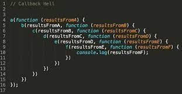
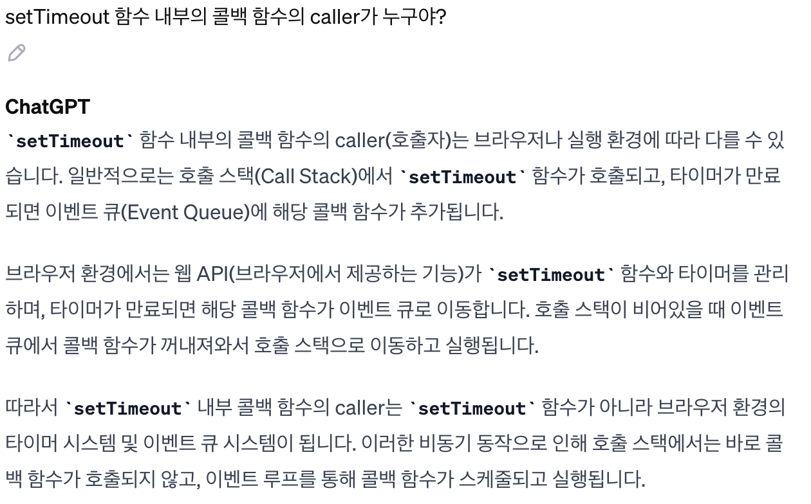
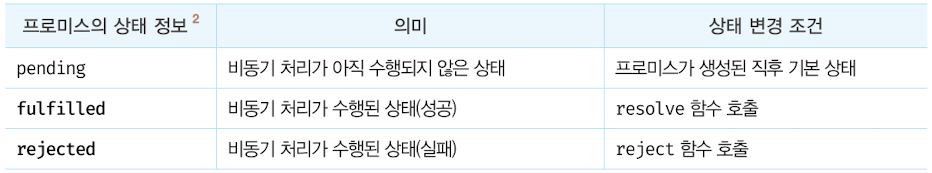
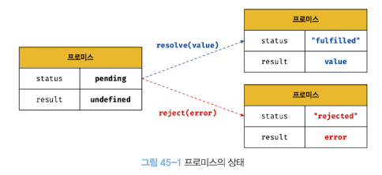
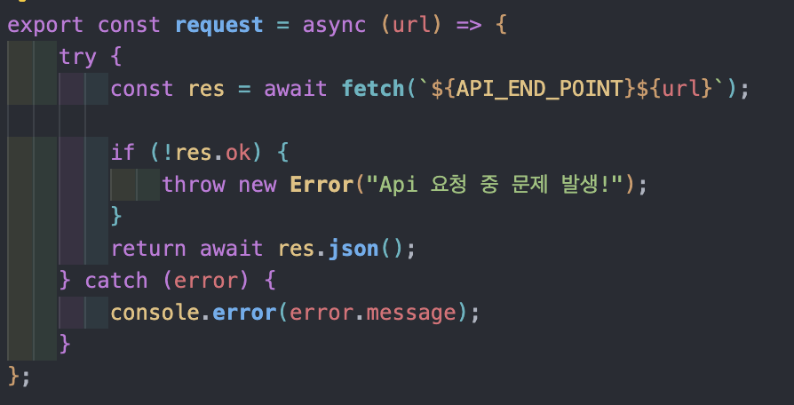

# 45장 프로미스

**비동기 처리를 위한 하나의 패턴**으로 **콜백 함수**를 사용합니다. 하지만 전통적인 콜백 패턴은 여러 가지 한계가 있습니다.

전통적인 콜백 패턴의 한계점

1. 콜백 헬로 인한 가독성 저하
2. 비동기 처리 중 발생한 에러의 처리 곤란
3. 여러 개의 비동기 처리를 한 번에 처리하기 힘든 한계

이런 단점들을 보완하기 위해 프로미스가 등장했습니다.

## 45.1 비동기 처리를 위한 콜백 패턴의 단점

### 45.1.1 콜백 헬

**비동기(asynchronous)란?**

> **자바스크립트는 단일 스레드, 동기식으로 동작합니다**.

하지만 비동기는 **어떠한 요청을 보내면 그 요청이 끝날 때까지 기다리는 것이 아니라, 응답에 관계없이 바로 다음 동작이 실행되는 방식**을 말합니다.

자세히 얘기하자면 비동기 함수 내부의 비동기로 동작하는 코드는 비동기 함수가 종료된 이후에 완료됩니다. 따라서 비동기 함수 내부의 비동기로 동작하는 코드에서 처리 결과를 외부로 반환하거나 상위 스코프의 변수에 할당하면 기대한 대로 동작하지 않습니다.

대표적으로는 Web Api의 Timer Api, DOM 관련 메서드, HTTP 요청 등이 있습니다.

>

```jsx
let g = 0;

setTimeout(() => {
  g = 100;
}, 0);
console.log(g); // 0

// console.log(g) 가 먼저 실행이 되고
// setTimeout 내부의 콜백 함수가 실행이 됩니다.
```

> **왜 필요한가?**
> 웹 페이지가 로딩되거나, 어떠한 동작(Event) 하나가 30초 이상이 걸린다면 웹 페이지는 이 동작이 끝날 때까지 화면에 나타나지 않거나 다음 동작을 수행하는데 지장을 주게 됩니다. 그렇기 때문에 자바스크립트가 웹 사이트에서 동작할 때, 비동기적으로 동작할 수 있어야 합니다.

> **어떻게 실행되는가?**
> 비동기 함수의 실행 컨텍스트가 생성되고 콜 스택에 푸시되었다가 비동기 함수가 종료되면서 콜백 함수를 태스크 큐에 전달합니다. 이후 콜 스택이 비면 이벤트 루프에 의해 콜 스택으로 푸시되어 실행됩니다.

위의 예제를 토대로 설명해보겠습니다.
콜 스택에 g 라는 변수에 0을 할당하고 종료, setTimeout을 실행하고 종료시키며 태스크 큐에 g에 100을 할당하는 콜백 함수를 전달합니다. 그러나 console.log(g)가 먼저 콜 스택에 올라오면서 g는 아직 0 이므로 0을 출력하고 종료됩니다. 이후 콜 스택이 비었으므로 태스크 큐에 있던 콜백 함수가 콜 스택으로 전달됩니다.

이처럼 비동기 함수는 비동기 처리 결과를 외부에 반환할 수 없고, 상위 스코프의 변수에 할당할 수도 없습니다.
따라서 **비동기 함수의 처리 결과에 대한 후속 처리**는 **비동기 함수 내부에서** 수행해야 합니다. 이때 후속 처리를 위해 콜백 함수를 비동기 함수에 전달하는 것이 전통적인 패턴입니다.
비동기 처리가 성공하면 호출될 콜백 함수와 실패하면 호출될 콜백 함수를 전달할 수 있습니다.

그러나 이는 비동기 처리 결과에 대한 후속 처리를 수행하는 콜백 함수가 계속 중첩되어 복잡도가 높아지는 **콜백 헬** 현상이 일어납니다.



### 45.1.2 에러 처리의 한계

**에러는 호출자 방향으로 전파됩니다.** 예시를 보며 살펴보겠습니다.

```jsx
try {
  setTimeout(() => {
    throw new Error('Error');
  }, 1000);
} catch (error) {
  // 에러를 캐치하지 못한다.
  console.error('캐치한 에러', error);
}
```

위 예제에서 setTimeout은 실행되자마자 종료 돼서 콜 스택에서 사라집니다. 이는 setTimeout의 콜백 함수를 호출한 것이 setTimeout 함수가 아니게 됩니다. 따라서 setTimeout 함수의 콜백 함수가 발생시킨 에러는 catch 블록에서 캐치되지 않습니다.

그렇다면 setTimeout 함수 내부의 콜백 함수의 호출자는 누구일까요?

ChatGPT의 도움을 받아 알아봤습니다.



이런 콜백 헬이나 에러 처리가 곤란하다는 문제를 극복하기 위해 프로미스가 도입되었습니다.

## 45.2 프로미스의 생성

Promise 생성자 함수를 new 연산자와 함께 호출하면 프로미스를 생성합니다.
Promise 생성자 함수는 비동기 처리를 수행할 콜백 함수를 인수로 전달받는데 이 콜백 함수는 resolve와 reject 함수를 인수로 전달받습니다.

```jsx
const promise = new Promise((resolve,reject)=>{
  // Promise 함수의 콜백 함수 내부에서 비동기 처리를 수행한다,
  if( /** 비동기 처리 성공 */){
    resolve('result')
  }else {/** 비동기 처리 실패 */
    reject('failure reason')
  }
})
```

프로미스는 다음과 같이 현재 **비동기 처리가 어떻게 진행되고 있는지를 나타내는 상태 정보**를 갖습니다.



생성된 직후의 프로미스는 기본적으로 `pending` 상태입니다. 이후 비동기 처리가 수행되고 결과에 따라 상태가 변합니다. fulfilled나 rejected 상태를 `settled` 상태라고 합니다.

프로미스는 비동기 처리 상태와 더불어 비동기 처리 결과도 상태로 갖습니다.
즉, **프로미스는 비동기 처리 상태와 처리 결과를 관리하는 객체**입니다.



## 45.3 프로미스의 후속 처리 메서드

이 프로미스에 있는 처리 결과를 갖고 무언가를 하기 위해 후속 처리 메서드가 필요합니다.

프로미스의 비동기 처리 상태가 변화하면 후속 처리 메서드에 인수로 전달한 콜백 함수가 선택적으로 호출됩니다. 이때 후속 처리 메서드의 콜백 함수에 프로미스의 처리 결과가 인수로 전달됩니다.
또한 모든 후속 처리 메서드는 **프로미스를 반환**하며, 비동기로 동작합니다.

### 45.3.1 Promise.prototype.then

전통적인 패턴과 동일하게 성공과 실패를 다룰 2개의 콜백 함수를 인수로 전달받습니다. 그러나 then 내부에서 발생하는 에러를, then 내부의 실패를 다루는 콜백함수에서 잡아내지 못하기 때문에 에러를 잡아내는 것은 catch에 맡기고 then에서는 `fulfilled상태`(비동기 처리가 성공했을 때) 만 처리한다고 생각하시면 될 것 같습니다. 이는 뒤에서 자세히 알아보겠습니다.

### 45.3.2 Promise.prototype.catch

catch 메서드는 한 개의 콜백 함수를 인수로 전달받습니다. catch 메서드의 콜백 함수는 프로미스가 `rejected 상태`일 경우만 호출됩니다.

### 45.3.3 Promise.prototype.finally

finally 메서드는 한 개의 콜백 함수를 인수로 전달받습니다. 프로미스의 성공 또는 실패와 상관없이 무조건 한 번 호출됩니다. finally 메서드는 프로미스의 상태와 상관없이 공통적으로 수행해야 할 처리 내용이 있을 때 유용합니다.

## 45.4 프로미스의 에러 처리

전통적인 콜백 패턴은 에러 처리가 곤란하다는 문제가 있었습니다.
비동기 처리에서 발생한 에러는 then 메서드의 두 번째 콜백 함수로 처리할 수 있습니다.

```jsx
promiseGet(wrongUrl).then(
  (res) => console.log(res),
  (err) => console.error(err)
); // Error: 404
```

또는 프로미스의 후속 처리 메서드 catch를 사용해 처리할 수 있습니다.

```jsx
promiseGet(wrongUrl)
  .then((res) => console.log(res))
  .catch((err) => console.error(err)); // Error: 404
```

다만, then 메서드의 두 번째 콜백 함수는 첫 번째 콜백 함수에서 발생한 에러를 캐치하지 못하고 코드가 복잡해져서 가독성이 좋지 않습니다. catch 메서드를 모든 then 메서드를 호출한 이후에 호출하면 비동기 처리에서 발생한 에러(rejected 상태) 뿐만 아니라 then 메서드 내부에서 발생한 에러까지 모두 캐치할 수 있습니다.

**따라서 에러 처리는 `then 메서드`에서 하지 말고 `catch 메서드`에서 하는 것을 권장합니다.**

## 45.5 프로미스 체이닝

전통적인 콜백 패턴에서는 콜백 헬이 발생하는 문제가 있었습니다.

프로미스는 then, catch, finally 후속 처리 메서드를 통해 콜백 헬을 해결합니다.

프로미스 후속 처리 메서드는 프로미스를 반환하고, 반환된 프로미스를 다시 후속 처리 메서드에 전달할 수 있습니다. 만약 후속 처리 메서드의 콜백 함수가 프로미스가 아닌 값을 반환하더라도 그 값을 암묵적으로 resolve 또는 reject하여 프로미스를 생성해 반환합니다.

이처럼 then, catch, finally 후속 처리 메서드는 언제나 프로미스를 반환하므로 연속적으로 호출할 수 있습니다.
예를 들자면 then, then, then, catch, finally 처럼 여러개의 후속 처리 메서드로 연결할 수 있습니다.

이를 **`프로미스 체이닝`** 이라고 합니다.

```jsx
promiseGet(`${url}/posts/1`)
  .then(({ userId }) => promiseGet(`${url}/users/${userId}`))
  .then((userInfo) => console.log(userInfo))
  .catch((err) => console.error(err)); // Error: 404
```

다만 프로미스도 콜백 패턴을 사용하므로 가독성이 좋지 않을 수 있습니다. 이를 해결하기 위해 async / await 가 등장하게 되었습니다. async/ await를 사용하면 프로미스의 후속 처리 메서드 없이 마치 동기 처리처럼 프로미스가 처리 결과를 반환하도록 구현할 수 있습니다.

이는 나중에 알아보도록 하겠습니다.

## 45.6 프로미스의 정적 메서드

Promise는 주로 생성자 함수로 사용되지만 함수도 객체이므로 메서드를 가질 수 있습니다.

### 45.6.1 Promise.resolve / Promise.reject

이미 존재하는 값을 래핑하여 프로미스를 생성하기 위해 사용합니다.

### 45.6.2 Promise.all

여러 개의 비동기 처리를 모두 병렬 처리할 때 사용합니다. 다만 한가지라도 rejected 상태가 된다면 에러를 reject하는 새로운 프로미스를 반환하고 바로 종료됩니다.

### 45.6.3 Promise.race

여러 개의 비동기 처리 중 가장 먼저 fulfilled 상태가 된 프로미스의 처리 결과를 resolve 하는 새로운 프로미스를 반환합니다. 프로미스가 rejected 상태가 되면 Promise.all 메서드와 동일하게 처리됩니다.

### 45.6.4 Promise.allSettled

전달받은 프로미스가 모두 settled 상태(fulfilled 또는 rejected 상태) 가 되면 처리 결과를 배열로 반환합니다.

## 45.7 마이크로태스크 큐

프로미스의 후속 처리 메서드의 콜백 함수는 태스크 큐가 아니라 **`마이크로태스크 큐`** 에 저장됩니다.

그 외의 비동기 함수의 콜백 함수나 이벤트 핸들러는 **`태스크 큐`** 에 일시 저장됩니다.

**마이크로태스크 큐는 태스크 큐보다 우선순위가 높습니다. 즉 실행 순서가 더 앞선다는 의미입니다.**

```jsx
setTimeout(() => console.log(1), 0);

Promise.resolve()
  .then(() => console.log(2))
  .then(() => console.log(3));

// 결과는 2 -> 3 -> 1
```

## 45.8 fetch

fetch 함수는 HTTP 응답을 나타내는 Response 객체를 래핑한 Promise 객체를 반환합니다.

fetch 함수는 404에러 등이 발생해도 reject 하지 않고 불리언 타입의 ok 상태를 false로 설정한 Response 객체를 resolve합니다. 오프라인 등의 네트워크 장애나 CORS 에러에 의해 요청이 완료되지 못한 경우에만 프로미스를 reject 합니다.

과제에서 항상 보였던 res.ok 입니다.



따라서 async/ await 을 통해 반환된 프로미스 값을 받아올 수 있게 됩니다.
