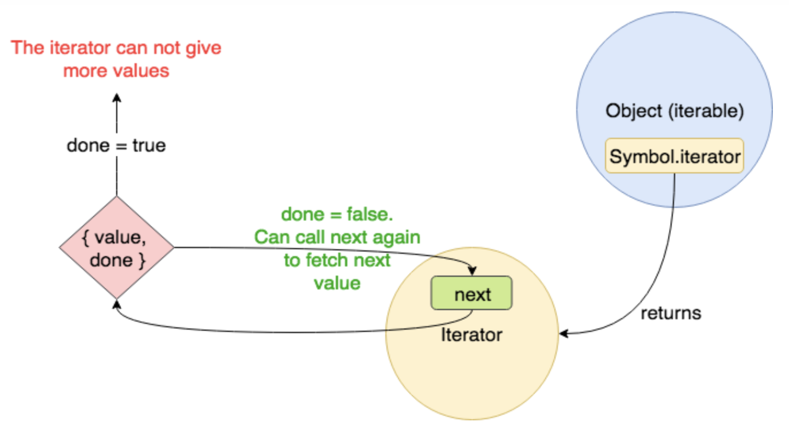

# 46장 제너레이터와 async/await

# 46.1 제너레이터란?

ES6에서 도입된 제너레이터(generator)는 `코드 블록의 실행을 일시 중지 했다가 필요한 시점에 재개할 수 있는 특수한 함수` 입니다. 

### 왜 제너레이터에 대해서 알아야 할까?

> **async/await**의 내부는 **제너레이터**와 **프로미스**로 이루어져있다.
> 

### 제너레이터와 일반 함수의 차이는 무엇일까?

1. 제너레이터 함수는 **함수 호출자에게 함수 실행의 제어권을 양도**할 수 있다.
- `일반 함수` 호출자(caller)가 일반 함수를 호출하면, 제어권이 호출된 함수에게 넘어가며 함수 코드를 `일괄 실행` 한다.
- 이에 반해 `제너레이터 함수` 호출자는 제너레이터 호출을 제어할 수 있다. 다시 말해 `호출자가 함수 실행을 중지시키거나 재개` 시킬 수 있다.
2. 제너레이터 함수는 함수 **호출자와 함수의 상태를 주고받을 수 있다.**
- `일반 함수` 는 **이미 실행이 되는 동안에는** 함수 외부에서 받은 값(매개변수)을 내부로 전달해 `함수 상태를 변경할 수가 없다.`
- 그러나 `제너레이터 함수` 는 호출자와 `양방향` 으로 상태를 주고 받을 수 있다.
3. 제너레이터 함수를 호출하면 **제너레이터 객체를 반환한다.**
- `제너레이터 함수` 를 호출하면 함수 코드를 실행하는 것이 아니라, `이터러블` 이면서 동시에 `이터레이터` 인 **제너레이터 객체를 반환한다.**



### 이터러블
- 자료를 반복할 수 있는 객체 `ex)배열`
- Symbol.iterator 메서드를 상속받는다.
    - 제너레이터 객체는 `이터레이터` 이기도 하므로 별도로 해당 메서드를 통해 이터레이터를 생성할 필요는 없다.
- 이터러블한 것은 for…of 같은 반복문 사용이 가능하다.

### 이터레이터
- { value, done } 프로퍼티를 갖고,
    - done=true이면 반복종료를 의미
- next() 메서드(이터레이터 객체를 리턴하는 메서드)를 가진 객체.

# 46.2 제너레이터 함수의 정의

- `function*` 키워드로 선언하고, 하나 이상의 `yield` 표현식을 포함한다.
- 화살표 함수로 정의할 수 없다. (표현식, 선언문만 가능)
- new 연산자와 함께 생성자 함수로 호출할 수 없다.

```jsx
function* genDecFunc() {
	yield 1;
}
```

- `yield` : 제너레이터 함수를 멈추거나 다시 시작하게 만드는 키워드

> yield 뜻 - 양보하다, 무언가를 내어주다


# 46.3 제너레이터 객체

제너레이터 함수를 호출하면 함수 코드 블록을 실행하는 것이 아니라, **제너레이터 객체를 생성해 반환한다.** 
이 제너레이터 객체는 `이터러블(iterable)` 이면서 동시에 `이터레이터(iterator)` 다.

```
1. 제너레이터 객체는 Symbol.iterator 메서드를 상속받는 `이터러블` 이면서, 
2. value, done 프로퍼티를 갖는 이터레이터 리절트 객체를 반환하는 next() 메서드를 소유하는 `이터레이터` 다.
```

> 제너레이터 객체는 `next` 메서드를 가진 이터레이터지만, 이터레이터에는 없는 `return`, `throw` 메서드도 갖는다.
> 

### next, return, throw 예제

```jsx
function* genFunc() {
	try {
		yield 1;
		yield 2;
		yield 3;
	} catch(e) {
		console.error(e);
	}
}

const generator = genFunc(); // 제너레이터 함수는 제너레이터 객체를 반환한다.

console.log(generator.next()); // {value: 1, done: false}
console.log(generator.return('End!')); // {value: 'End!', done: true}
console.log(generator.throw('Error!')); // Error! {value: undefined, done: true}
```

- **next** 메서드를 호출하면
    - 제너레이터 함수의 **yield 표현식까지 코드 블록을 실행**하고,
    - { value: `yield된 값` , done: `false` } ← 이터레이터 리절트 객체를 반환한다.
- **return** 메서드 를 호출하면
    - { value: `인수로 전달 받은 값` , done: `true` } ← 이터레이터 리절트 객체를 반환한다.
- **throw** 메서드 를 호출하면
    - 인수로 전달 받은 에러를 발생시키고,
    - { value: `undefined` , done: `true` } ← 이터레이터 리절트 객체를 반환한다.

### done=true인 것에 next(), return() 를 하면?

> { value: `undefined` , done: `true` }
> 

# 46.4 제너레이터의 일시 중지와 재개

`제너레이터 함수` 는 일반 함수와는 다르게 함수 `호출자에게 제어권을 양도(yield)` 하여 **필요한 시점에 함수 실행을 재개할 수 있다.**

다시 말해서, 제너레이터 함수를 호출하면 **제너레이터 객체를 반환**하고, 

현재 실행 중인 함수(caller)에서 제너레이터 객체의 `next` 메서드를 호출하면 **제너레이터 함수에게 제어권을 넘겨** 제너레이터 함수의 코드 블록을 실행하다가 `yield` 를 만나면 다시 호출한 함수 **(caller)에게 제어권을 양보**한다.

```jsx
function* genFunc() {
	yield 1;
	yield 2;
	yield 3;
}

const generator = genFunc(); // 제너레이터 함수는 제너레이터 객체를 반환한다.

console.log(generator.next()); // {value: 1, done: false}
console.log(generator.next()); // {value: 2, done: false}
console.log(generator.next()); // {value: 3, done: false}
console.log(generator.next()); // {value: undefined, done: true}
```

- 제너레이터 객체의 `next` 메서드를 호출하면 `yield` 표현식까지 실행되고 **일시중지(suspend)** 된다.
    - 이때 함수의 제어권이 호출자로 양도(yield) 된다.
- 반환값 : { value: `yield된 값` , done: `제너레이터 함수가 끝까지 실행되었는가` }
    - 제너레이터 함수가 끝까지 실행되면 {value: `return값` , done: `true` }
    - 해당 예제에서는 제너레이터 함수에 return 값이 없으므로 undefined 다.

### 만약 리턴 값이 존재한다면?

```jsx
function* genFunc() {
	...
	return 'end!'
}
....
console.log(generator.next()); // {value: 'end!', done: true}
```

> 그러나… 일반적으로 **리턴값은 제너레이터에서는 큰 의미가 없다.** 
제너레이터 함수에서 `return` 은 정말 `종료` 의 의미로만 사용된다.
> 

### 제너레이터 객체의 next 메서드에는 인수를 전달할 수 있다

제너레이터객체.next(인수)의 `인수` 는 제너레이터 함수의 `yield 표현식을 할당받는 변수에 할당` 된다.

⚠️ `yield 표현식을 할당받는 변수` 에는 **yield 표현식의 평가 결과가 할당되지 않는다!**

```jsx
//x=1, y=x+10이 아님!!!!!!!
function* genFunc() {
    const x = yield 1; // (2)실행 시 x=10으로 할당 된다.
    const y = yield (x+10); // (3)실행 시 y=20으로 할당 된다.
    return x+y;
}

const generator = genFunc(); // 제너레이터 함수는 제너레이터 객체를 반환한다.

(1) console.log(generator.next()); // {value: 1, done: false}
(2) console.log(generator.next(10)); // {value: 10, done: false}
(3) console.log(generator.next(20)); // {value: 30, done: true}
```

1.  처음 호출하는 next에는 **인수를 전달할 수 없다. 인수를 넣어도 무시된다.**
    - `x` 변수에는 아직 아무것도 할당되지 않았다. 두번째 next 때 결정된다.
    - { value: `1` , done: false } ← 리턴값
2. 인수 `10` 은 제너레이터 함수의 yield 표현식을 할당 받는 `x` 변수에 할당된다. 
    - `y` 변수에는 아직 아무것도 할당되지 않았다. 세번째 next 때 결정된다.
    - { value: `10+10 = 20` , done: false } ← 리턴값
3. 인수 `20` 은 제너레이터 함수의 yield 표현식을 할당 받는 `y` 변수에 할당된다.
    - yield가 없으므로 제너레이터 함수 끝까지 실행된다.
    - { value: `10+20 = 30` , done: true } ← 리턴값

# 46.5 제너레이터의 활용

### 프로미스의 then/catch/finally 없이 비동기 처리를 동기 처리처럼 구현할 수 있다 → async/await

제너레이터 함수는 `next` 와 `yield` 를 통해 함수 **호출자와 함수의 상태를 주고받을 수 있다.**

```jsx
const async = (generatorFunc) => {
    const generator = generatorFunc(); // (2)

    const onResolved = arg => {
        const result = generator.next(arg); //(5)
        return result.done ? 
				result.value : result.value.then(res => onResolved(res)); //(7)
    };

    return onResolved;
}

function* fetchTodo(){
    const url = 'https://jsonplaceholder.typicode.com/todos/1';
    const res = yield fetch(url); // (6)
    const todo = yield res.json();
    console.log(todo);
}

const onResolved = async(fetchTodo); // (1)
onResolved(); //(4)
```

- (1) async 함수가 호출되면, (2) 인수로 전달한 제너레이터 함수 fetchtodo가 실행되어 제너레이터 객체를 생성하고, (3) onResolved 함수를 반환한다.
    - 이때 onResolved는 generator을 기억하는 클로저가 된다.
- (4) 반환받은 onResolved 함수를 실행하여 (5) generator.next()를 처음 실행한다.
- next()가 처음 호출되면 (6) 제너레이터 함수 fetchTodo의 첫번째 yield까지 실행된다.
    - 이때 반환되는 이터레이터 리절트 객체는 
    {value: `fetch()가 반환한 프로미스가 resolve한 Response객체` , done: `false` } 이다.
    - 그러므로 onResolved는 (7) `Response객체` 를 다시 onResolve함수를 재귀호출하며 인수로 전달한다.
- 다시 next()로 호출하면 두번째 yield까지 실행되는데, 이때 next의 인수로 받은 `Response객체`는 (6) `res` 에 할당된다.
    - 이때 반환되는 이터레이터 리절트 객체는 
    {value: `response.json()가 반환한 프로미스가 resolve한 todo객체` , done: `false` } 이다.
    - 그러므로 onResolved는 (7) `todo 객체` 를 다시 onResolve 함수를 재귀호출하며 인수로 전달한다.
- 세번째 next() 호출하면, 끝까지 실행이 되는데 이때 next의 인수로 받은 `todo객체` 는 `todo` 에 할당된다.
    - 이때 반환되는 이터레이터 리절트 객체는
    {value: `undefined` , done: `true` } 이다. (fetchTodo엔 return값이 없으므로..)
- `done: true` 이므로 모든 실행이 종료된다.

# 46.6 async/await

제너레이터를 사용해서 비동기처리를 동기처리처럼 만들어보았지만, 코드가 장황하고 가독성이 나쁘다.

이를 개선해 제너레이터보다 더 간단하고 가독성 좋게 구현한 것이 ES8에서 나온 `async/await` 이다.

### async/await는 프로미스 기반으로 동작한다

프로미스의 후속 처리 메서드(then/catch/finally) 없이 동기 처리처럼 프로미스가 처리 결과를 반환하도록 구현할 수 있다.

```jsx
//위 예제를 async/await로 간단하게 만들 수 있다.
async function fetchTodo() {
    const url = 'https://jsonplaceholder.typicode.com/todos/1';
    const res = await fetch(url); // (6)
    const todo = await res.json();
    console.log(todo);
}

fetchTodo();
```

### async 함수

async 함수는 언제나 반환값을 resolve하는 프로미스를 반환한다. 

```jsx
async function foo(n) { return n; }
console.log(foo(1)) // Promise {1}
foo(1).then(v=>console.log(v)); //1
//명시적으로 반환하지 않아도 async는 암묵적으로 반환값을 resolve하는 프로미스를 반환한다.
//그래서 .then으로 처리가 가능하다.
```

### await 함수

프로미스가 `settled` 상태(비동기 처리가 수행된 상태)가 될 때까지 대기하다가 settled 상태가 되면 프로미스가 resolve 한 처리 결과를 반환한다.

await 키워드는 반드시 `프로미스 앞에서 사용` 해야 한다.

```jsx
const getGithubUserName = async id => {
    (1) const res = await fetch(`https://api.github.com/users/${id}`);
    console.log(res) // response{} 객체
    const {name} = await res.json();
    console.log(name);
}

getGithubUserName('ungmo2')
```

- fetch 함수가 반환한 프로미스가 settled 상태가 될 때까지 (1) 에서 `대기` 한다. 이후 settled 상태가 되면 프로미스가 resolve한 처리 결과가 res 변수에 할당된다.

### 순차적으로 처리할 필요가 없을 때는?

> Promise.all을 활용하기

```jsx
async function foo() {
    const res = await Promise.all([
        new Promise(resolve=> setTimeout(()=> resolve(1), 3000)),
        new Promise(resolve=> setTimeout(()=> resolve(2), 2000)),
        new Promise(resolve=> setTimeout(()=> resolve(3), 1000))
    ])

    console.log(res)
}

foo(); //약 3초 소요
```

### 앞선 비동기 처리의 결과를 가지고 다음 비동기 처리를 수행해야할 때는?

> 모든 프로미스에 await 키워드를 사용하기

```jsx
async function foo(n) {
    const a = await new Promise(resolve => setTimeout(()=>resolve(n), 3000));
    const b = await new Promise(resolve => setTimeout(()=>resolve(a+1), 2000));
    const c = await new Promise(resolve => setTimeout(()=>resolve(b+1), 1000));

    console.log([a,b,c])
}

foo(1); //약 6초 소요
```

### 에러처리 - try/catch

```jsx
const foo = async () => {
    try {
        const wrongUrl = 'https://wrong.url';
        const res = await fetch(wrongUrl);
        const data = await res.json();
        console.log(data);
    } catch(e) {
        console.error(e); //TypeError: Faild to fetch
    }
}

foo();
```

http 통신에서 발생한 네트워크 에러 뿐만 아니라, try코드 블록 내의 모든 `일반적인 에러까지 캐치` 할 수 있다.

만약 async 함수 내에서 try/catch로 에러처리를 하지 않으면, async 함수는 발생한 에러를 reject하는 프로미스를 반환한다. 따라서 프로미스 후속 처리 메서드 catch를 사용할 수도 있다.