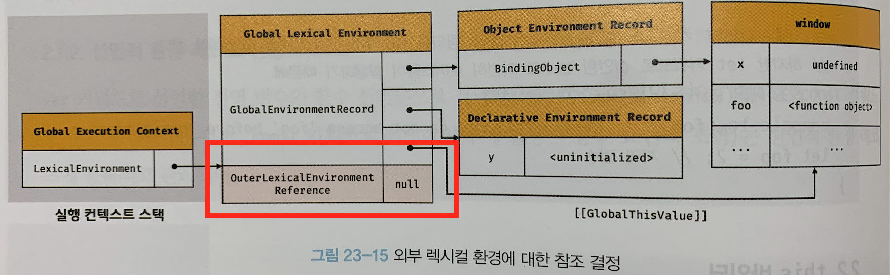

# 23장. 실행 컨텍스트

실행 컨텍스트는 자바스크립트의 동작 원리를 담고 있는 핵심 개념입니다.

실행 컨텍스트를 이해하면 아래의 세 가지 개념에 대해서도 이해할 수 있게 됩니다 🤗

1. **호이스팅**이 발생하는 이유
2. **클로저**의 동작 방식
3. **태스크 큐**와 함께 동작하는 이벤트 핸들러와 **비동기 처리의 동작 방식**

## 23.1 소스코드의 타입

ECMAScript 사양은 소스 코드를 4가지 타입으로 구분합니다.


왜 소스 코드를 여러 타입으로 구분하는 걸까요? 🤔
그 이유는 **타입에 따라 실행 컨텍스트를 생성하는 과정과 내용이 다르기 때문**입니다.

각 타입에 대해 알아보기 전에 평가와 실행 과정에 대해 알아보겠습니다.

자바스크립트 엔진은 코드를 **`평가와 실행 과정`** 으로 나누어서 처리합니다.
**실행 컨텍스트는** **코드 평가 단계에서 생성**되고 평가 과정이 끝나면 소스 코드가 순차적으로 실행됩니다.

#### 1. 전역 코드

- 전역 **코드가 평가되면** 전역 실행 컨텍스트가 생성됨
- **`전역 변수를 관리`** 하기 위해 **`전역 스코프`** 생성
- 예시:
  - var로 선언된 전역 변수
  - 함수 선언문으로 선언된 전역 함수

#### 2. 함수 코드

- 함수 코드가 평가되면 함수 실행 컨텍스트가 생성됨
- 지역 변수, 매개 변수, arguments 객체를 관리하기 위해 **`지역 스코프`** 생성
- 생성한 **`지역 스코프`** 를 **전역 스코프에서 시작하는 스코프 체인의 일원으로 연결**

#### 3. eval 코드

- eval 코드가 평가되면 eval 실행 컨텍스트가 생성됨
- strict mode에서 자신만의 독자적인 스코프를 생성

#### 4. 모듈 코드

- 모듈 코드가 평가되면 모듈 실행 컨텍스트가 생성됨
- 모듈별로 독립적인 모듈 스코프를 생성합니다.

<br />

## 23.2 소스코드의 평가와 실행

앞서 확인했던 개념에 이어서 자바스크립트 엔진은 소스코드를 **`평가`** 와 **`실행`** 과정으로 나누어서 처리합니다.


쉽게 생각하면, 코드 실행에 필요한 **정보들을 미리 평가 단계에서 등록**해두고
**실행 단계에서는 등록해둔 정보를 참조**하는 것입니다.

<br />

### 예시

예시 코드를 통해 평가와 실행 과정에 대해 이해해보겠습니다.

```js
var x;
x = 1;
```

#### 소스코드 평가

- 실행 컨텍스트 생성
- 변수, 함수 등의 **선언문만 먼저 실행**
  - `var x;` 코드의 x 변수를 undefined로 초기화
- 실행 컨텍스트의 스코프에 등록
  - `var x;`가 전역에 선언된 경우 전역 스코프에 등록

#### 소스코드 실행

- 선언문을 제외한 소스코드가 순차적으로 실행
  - `x = 1;` 실행
  - x에 값을 할당하려면 x가 선언된 변수인지 확인 필요
  - 해당 스코프에 x가 등록되어 있는지 확인
  - 전역 스코프에 x가 등록되어 있음.
- x의 값을 1로 할당하고 할당된 결과를 실행 컨텍스트에 등록

<br />

## 23.3 실행 컨텍스트의 역할

**전역 코드와 함수 코드**로 구성되어 있는 예제를 통해 평가와 실행 과정에 대해 알아보겠습니다.

```js
// 전역 변수 선언
const x = 1;
const y = 2;

// 함수 정의
function foo(a) {
  // 지역 변수 선언
  const x = 10;
  const y = 10;

  // 메서드 호출
  console.log(a + x + y); // 120
}

// 함수 호출
foo(100);

// 메서드 호출
console.log(x + y); // 3
```

#### 1. 전역 코드 평가

- 변수 선언문, 함수 **선언문을 먼저 실행**
- 생성된 전역 변수와 전역 함수가 **전역 스코프에 등록**됨
- 전역 변수와 전역 함수는 **전역 객체의 프로퍼티와 메서드가 됨**
  - 예: const x는 window.x와 같다.

#### 2. 전역 코드 실행

- 전역 코드 순차적으로 실행
- 전역 변수에 값이 할당됨
- 함수가 호출됨
  - **`전역 코드의 실행을 일시 중단`**
  - 실행 순서를 변경하여 함수 **`내부로 진입!`**

#### 3. 함수 코드 평가

- 함수 내부로 진입하게 되면 **`함수 평가 과정`** 을 가짐
- 매개변수와 지역 변수 **선언문이 실행**
- 매개변수와 지역 변수가 **`지역 스코프에 등록`** 됨
- 함수 내부에서 지역 변수처럼 사용할 수 있는 **arguments 객체가 생성**되어 지역 스코프에 등록됨
- **this 바인딩 결정**

#### 4. 함수 코드 실행

- 함수 코드 순차적으로 실행
- 매개변수와 지역 변수에 값이 할당됨
- console.log 메서드 호출
  - 식별자인 console을 스코프 체인을 통해 검색
  - console 식별자는 스코프 체인에 등록되어 있지 않고 전역 객체에 프로퍼티로 존재함
  - **지역 스코프가 전역 스코프와 연결되어야 하는 이유**
- 전역 스코프를 통해 console 객체에 접근
  - log 프로퍼티를 console 객체의 **프로토타입 체인**을 통해 검색
- console.log 메서드에 인수로 전달된 a+x+y가 평가됨
  - a+x+y도 마찬가지로 스코프 체인을 통해 검색
- 함수 코드 실행 과정 종료
- 호출 **이전으로 돌아가서 전역 코드를 실행**

<br />

#### 코드가 실행되려면 필요한 것들

1. **스코프를 구분**하여 식별자(변수, 함수, 클래스 등)들이 관리되어야 함
   - 전역 스코프, 지역 스코프
2. **스코프 체인**을 형성하여 식별자를 검색할 수 있어야 함
   - 지역 스코프가 전역 스코프와 연결되어 있어야 전역 스코프에 등록된 값을 참조할 수 있음
3. 전역 객체의 프로퍼티도 전역 변수처럼 검색할 수 있어야 함
   - console은 전역 객체에 프로퍼티로 존재함
   - 함수 내부에서도 스코프 체인을 통해서 검색할 수 있음
4. 현재 실행 중인 코드의 **실행 순서를 변경**할 수 있어야 하며 다시 되돌아갈 수도 있어야 함
   - 함수 호출에 의한 실행 순서 변경

이 모든 것을 관리하는 것이 바로 ✨실행 컨텍스트✨입니다.
모든 코드는 실행 컨텍스트를 통해 실행되고 관리됩니다.

<br />

#### 실행 컨텍스트의 역할

- 식별자를 등록하고 관리하는 **`스코프와 실행 순서 관리`** 를 구현한 내부 메커니즘
- 식별자, 스코프 => **`렉시컬 환경`** 으로 관리
- 실행 순서 => **`실행 컨텍스트 스택`** 으로 관리

<br />

## 23.4 실행 컨텍스트 스택

자바스크립트는 어떻게 실행 순서를 관리할까요?
바로 실행 컨텍스트의 **스택 자료구조**를 통해 실행 순서를 관리합니다.

예제를 통해 그 과정을 알아보겠습니다.

```js
const x = 1;

function foo() {
  const y = 2;

  function bar() {
    const z = 3;
    console.log(x + y + z);
  }

  bar();
}

foo(); // 6
```


### 1. 전역 코드의 평가와 실행

#### 평가 과정

- 전역 변수 x, 전역 함수 foo가 전역 실행 컨텍스트에 등록됨

#### 실행 과정

- 전역 변수 x에 값이 할당
- 전역 함수 foo가 호출됨

<br />

### 2. foo 함수 코드의 평가와 실행

#### 평가 과정

- foo가 호출되었기 때문에 **전역 코드의 실행이 일시 중단**됨
- **`foo 함수 실행 컨텍스트 생성`**
- 실행 컨텍스트 스택에 push
- foo 함수의 지역 변수 y와 중첩 함수 bar => foo 함수의 실행 컨텍스트에 등록됨

#### 실행 과정

- 지역 변수 y에 값이 할당
- 중첩 함수 bar 호출

<br />

### 3. bar 함수 코드의 평가와 실행

#### 평가 과정

- foo 함수의 코드 일시 중단됨
- **`bar 함수 실행 컨텍스트 생성`**
- 실행 컨텍스트 스택에 push
- bar 함수의 지역 변수 z가 실행 컨텍스트에 등록됨

#### 실행 과정

- 지역 변수 z에 값이 할당
- console.log 메서드 호출 후 bar 함수 종료

<br />

### 4. foo 함수로 복귀

- bar 함수의 실행 컨텍스트를 제거
- 더 실행할 컨텍스트가 없으므로 종료

<br />

### 5. 전역 코드로 복귀

- foo 함수의 실행 컨텍스트 제거
- 더 실행할 컨텍스트가 없으므로 전역 컨텍스트도 제거
- 실행 컨텍스트 스택에는 아무것도 남지 않게 됨

<br />

### 정리

이처럼 실행 컨텍스트 스택은 **코드의 실행 순서를 관리**합니다.

소스코드 평가 -> 실행 컨텍스트 생성 -> 스택의 최상위에 쌓임

여기서 **최상위에 존재하는 컨텍스트는 언제나 현재 실행 중인 컨텍스트**라고 합니다.

<br />

## 23.5 렉시컬 환경

실행 컨텍스트 스택이 코드의 실행 순서를 관리한다면
렉시컬 환경은 **스코프와 식별자를 관리**합니다.

즉, 스코프를 구분하여 식별자를 등록하고 관리하는 역할을 합니다.


<br />
<br />

실행 컨텍스트를 들여다보면 LexicalEnvironment 컴포넌트와 VariableEnvironment로 구성됩니다.


<br />
<br />

이 중 LexicalEnvironment는 두 개의 컴포넌트로 구성됩니다.


#### 환경 레코드

- 스코프에 포함된 식별자 등록
- 식별자에 바인딩된 값을 관리
- 소스코드 타입에 따라 내용에 차이가 생김

#### 외부 렉시컬 환경에 대한 참조

- 상위 스코프를 가리킴
- 상위 스코프란?
  - 해당 **실행 컨텍스트를 생성한 소스코드**를 포함하는 상위 코드의 **렉시컬 환경**

<br />

## 23.6 실행 컨텍스트의 생성과 식별자 검색 과정

백문이 불여일견... 😌
예제를 통해 다음 세 가지 과정에 대해 알아보겠습니다!

1. 실행 컨텍스트가 생성되는 과정
2. 코드 실행 결과가 관리되는 과정
3. 실행 컨텍스트를 통해 식별자를 검색하는 과정

```js
var x = 1;
const y = 2;

function foo(a) {
  var x = 3;
  const y = 4;

  function bar(b) {
    const z = 5;
    console.log(a + b + x + y + z);
  }
  bar(10);
}

foo(20);
```

### 1. 전역 객체 생성

전역 객체는 평가되기 이전에 생성됩니다.
전역 객체는 **Object.prototype**을 상속 받습니다. 즉, **프로토타입 체인의 일원**인 것입니다.

<br />

### 2. 전역 코드 평가

평가는 다음과 같은 순서로 진행됩니다.

1. 전역 실행 컨텍스트 생성
2. 전역 렉시컬 환경 생성
   - 2-1. 전역 환경 레코드 생성
     - 2-1-1. 객체 환경 레코드 생성
     - 2-1-2. 선언적 환경 레코드 생성
   - 2-2. this 바인딩
   - 2-3. 외부 렉시컬 환경에 대한 참조 결정

<br />

세부적인 생성 과정을 순서대로 살펴보겠습니다.

#### 1. 전역 실행 컨텍스트 생성

먼저 비어있는 전역 실행 컨텍스트를 생성하고 스택에 푸시합니다.


#### 2. 전역 렉시컬 환경 생성

그 다음 전역 렉시컬 환경을 생성하고, 전역 실행 컨텍스트에 바인딩합니다.


#### 2-1. 전역 환경 레코드 생성

ES6 이전에는 모든 전역 변수가 전역 객체의 프로퍼티가 되었기 때문에
**전역 객체가 전역 환경 레코드의 역할을 수행**했습니다.

하지만 ES6의 let,const 키워드로 선언한 전역 변수는 **전역 객체의 프로퍼티가 되지 않고 개념적 블록 내에 존재하게 됩니다.**

이처럼 기존의 var 키워드로 선언한 전역 변수와
**`let, const 키워드로 선언한 전역 변수를 구분하기 위해`**

전역 환경 레코드는 **`객체 환경 레코드`** 와 **`선언적 환경 레코드`** 로 구성되어있습니다.


#### 1. 객체 환경 레코드

- BindingObject라고 부르는 객체와 연결됨 (= 전역 객체)
- var 키워드로 선언한 전역 변수와 함수 선언문으로 정의한 전역 함수는 **BindingObject를 통해 전역 객체의 프로퍼티와 메서드**가 됩니다.


- `var x`의 경우 **선언 단계와 초기화 단계가 동시에 진행**됩니다.
- 즉, 전역 코드 평가 시점에 BindingObject를 통해 전역 객체에 암묵적으로 **undefined를 바인딩**합니다.

<br />

#### 호이스팅과 연관지어 이해하기

- 변수 var

  - **선언 단계와 초기화 단계가 동시에 진행**되어 undefined가 바인딩 되었기 때문에
  - 코드 실행 단계에서 변수 선언문 이전에도 참조할 수 있습니다.

- 함수 선언문
  - 함수가 평가되면 BindingObject를 통해 전역 객체에 함수를 즉시 할당함
  - 따라서 함수 선언문 이전에도 참조할 수 있습니다.

<br />

#### 2. 선언적 환경 레코드

- let, const 키워드로 선언한 전역 변수를 관리합니다.
- let, const 키워드로 선언한 전역 변수는 전역 객체의 프로퍼티가 되지 않고 **개념적인 블록에 존재**합니다.
- 즉, window.y와 같이 참조할 수 없다는 것입니다.

<br />

#### 호이스팅과 연관지어 이해하기

- **선언 단계와 초기화 단계가 분리**되어 진행됩니다.
- 따라서 초기화 단계, 변수 선언문에 도달하기 전까지 **`일시적 사각지대(TDZ)`** 에 빠지게 됩니다.


- 위 그림에서 y 변수에 바인딩된 `<uninitialized>`는 **초기화 단계가 진행되지 않아 변수에 접근할 수 없음**을 나타내기 위해 사용된 표현입니다.
- 주의할 점은, let, const로 선언한 변수도 **`호이스팅이 발생하는 것은 변함이 없습니다!`**
- 단, 일시적 사각지대(TDZ)에 빠지기 때문에 참조할 수만 없는 것입니다.

<br />

### 2-2. this 바인딩

전역 환경 레코드의 `GlobalThisValue` 내부 슬롯에 this가 바인딩 됩니다.


참고로 전역 환경 레코드를 구성하는 객체 환경 레코드와 선언적 환경 레코드에는 this 바인딩이 존재하지 않습니다.

**this 바인딩은 전역 환경 레코드와 함수 환경 레코드에만 존재**합니다!

<br />

### 2-3. 외부 렉시컬 환경에 대한 참조 결정

외부 렉시컬 환경에 대한 참조는 현재 소스 코드를 포함하는
외부 소스코드의 렉시컬 환경, **즉 상위 스코프를 가리킵니다.**

현재 평가 중인 코드는 전역 코드이므로 이를 포함하는 소스코드는 없습니다.

따라서 **스코프 체인의 종점에 존재**함을 의미하기 위해 참조에 *null*을 할당합니다.



<br />

### 3. 전역 코드 실행

```js
var x = 1;
const y = 2;

function foo(a) {
  var x = 3;
  const y = 4;

  function bar(b) {
    const z = 5;
    console.log(a + b + x + y + z);
  }
  bar(10);
}

foo(20);
```

- 변수에 값이 할당됩니다.
- foo 함수가 호출됩니다.

사실 이 작업들이 선행되기 위해서는 변수 또는 함수 이름이 **선언된 식별자인지 확인**해야 합니다. 또한, 동일한 이름의 식별자가 다른 스코프에 존재할 수 있습니다.

어느 스코프의 식별자를 참조하면 되는지 결정하는 것을 **`식별자 결정`** 이라고 합니다.

1. 현재 실행 중인 실행 컨텍스트에 등록된 식별자 검색
2. 없다면 상위 스코프로 이동

이 과정이 바로 스코프 체인의 동작 원리입니다!


<br />

### 4. foo 함수 코드 평가

foo 함수가 호출되면 전역 코드의 실행이 중단되고 제어권이 foo 함수 내부로 이동합니다.

함수 코드 평가 과정은 다음과 같습니다.

1. 함수 실행 컨텍스트 생성
2. 함수 렉시컬 환경 생성
   2-1. 함수 환경 레코드 생성 (3)
   2-2. this 바인딩 (4)
   2-3. 렉시컬 환경에 대한 참조 결정 (5)


#### 1. 함수 실행 컨텍스트 생성

foo 함수의 실행 컨텍스트를 생성하고 실행 컨텍스트 스택에 푸시합니다.

#### 2. 함수 렉시컬 환경 생성

foo 함수의 렉시컬 환경을 생성하고 foo 함수 실행 컨텍스트에 바인딩합니다.

#### 2-1. 함수 환경 레코드 생성

함수 환경 레코드에서는 `매개변수` `arguments 객체` 함수 내부에서 선언한 `지역 변수`와 `중첩 함수`를 등록하고 관리합니다.

#### 2-2. this 바인딩

함수 환경 레코드의 `ThisValue` 내부 슬롯에 this가 바인딩 됩니다.

foo 함수는 메서드가 아닌 일반 함수로 호출되었으므로 this는 전역 객체를 가리킵니다.

#### 2-3. 외부 렉시컬 환경에 대한 참조 결정

foo함수는 **전역 코드에 정의**된 함수이기 때문에 외부 렉시컬 환경 참조에는 **전역 렉시컬 환경의 참조가 할당**됩니다.

<br />

#### 정리

상위 스코프: **`함수를 어디에 정의`** 했는지에 따라 상위 스코프를 결정

this 바인딩: **`함수가 어떻게 호출`** 되는지에 따라 this에 바인딩 될 값이 동적으로 결정

<br />

### 5. foo 함수 코드 실행

이제 런타임이 시작되어 foo 함수의 코드가 순차적으로 실행됩니다.

매개변수에 인수가 할당되고 (a에 10할당) 변수 할당문이 실행되어 **지역변수 x,y에 각 3,4가 할당**됩니다.

그리고 bar함수가 호출됩니다.

<br />

### 6. bar 함수 코드 평가

bar 함수로 제어권이 이동하고 코드를 평가하기 시작합니다.

과정은 foo 함수 평가와 같습니다!


1. 실행 컨텍스트 생성 및 스택에 추가
2. 렉시컬 환경을 만들고 실행 컨텍스트와 바인딩
3. 환경 레코드 생성
4. this 바인딩 생성
5. 외부 렉시컬 환경 참조를 할당

<br />

### 7. bar 함수 코드 실행

런타임이 시작되어 bar 함수의 코드가 실행됩니다.

매개변수에 인수가 할당(b에 10할당)되고 z에 5를 할당합니다.

그리고 **`console.log(a + b + x + y + z);`** 가 실행됩니다.

#### 1. console 식별자 검색

1. 현재 bar 실행 컨텍스트의 렉시컬 환경에서부터 시작
2. 없으므로 외부 렉시컬 환경 참조
3. foo 함수의 렉시컬 환경 참조
4. 없으므로 **`전역 렉시컬 환경`** 참조
5. 객체 환경 레코드의 **`BindingObject`** 에서 console 식별자를 찾음

<br />

#### 2. log 메서드 검색

console 식별자에 바인딩된 객체, 즉 console 객체에서 log메서드를 검색합니다.

이때 console 객체의 **`프로토타입 체인`** 을 통해 메서드를 검색합니다.

<br />

#### 3. 표현식 a+b+x+y+z 평가

각 식별자들을 렉시컬 환경에서 검색합니다.

원리는 이전 탐색과 같습니다!

현재 실행 컨텍스트의 렉시컬 환경에서 시작해서 **외부 환경에 대한 참조로 연속해서 검색을 수행**합니다.

<br />

#### 4. console.log 메서드 호출

표현식 `a+b+x+y+z`가 평가되어 생성된 값 42를 `console.log` 메서드에 전달하여 호출합니다.

<br />

### 8. bar 함수 코드 실행 종료

bar 함수에 더 실행할 코드가 없기 때문에 실행을 종료합니다.

이 때 실행 컨텍스트 스택에서 bar 함수의 **실행 컨텍스트가 pop 되어 제거**됩니다.


<br />

### 9. foo 함수 코드 실행 종료

마찬가지로 foo 함수도 실행할 코드가 없으므로 실행을 종료하고 컨텍스트를 pop합니다.


<br />

### 10. 전역 코드 실행 종료

전역 코드의 실행이 종료되면 **전역 실행 컨텍스트도 실행 컨텍스트 스택에서 제거**합니다.

<br />

### 7. 실행 컨텍스트와 블록 레벨 스코프

var 키워드로 선언된 변수: 오로지 **함수의 코드 블록만 지역 스코프로 인정**하는 `함수 레벨 스코프`를 따릅니다.

let, const키워드로 선언한 변수: **모든 코드 블록을 지역 스코프**로 인정하는 `블록 레벨 스코프`를 따른다.

```js
let x = 1;

if (true) {
  let x = 10;
  console.log(x); // 10
}

console.log(x); // 1
```

예제를 보면 if문의 코드 블록 내에서
let 키워드로 변수가 선언되었습니다.

따라서 if문의 코드 블록이 실행되면 **블록 레벨 스코프를 생성**해야 합니다.

이를 위해서 선언적 환경 레코드를 가진 렉시컬 환경을 새롭게 생성하여서

기존의 전역 렉시컬 환경을 교체합니다.


if문의 코드 블록의 실행이 종료되면 이전의 렉시컬 환경으로 되돌립니다.


만약 for문의 변수 선언문에 let 키워드를 사용했다면,

**반복문마다 코드 블록을 위한 새로운 렉시컬 환경을 생성**합니다.

만약 for문의 코드 **`블록 내에서 정의된 함수`** 가 있다면, 이 함수의 **`상위 스코프`** 는 for문의 코드 블록이 **생성한 렉시컬 환경**입니다.

이 때 함수의 상위 스코프는 for문의 블록이 반복해서 실행될 때마다
식별자의 값을 유지해야 합니다.

이를 위해서 반복문마다 독립적인 렉시컬 환경을 생성하여 식별자의 값을 유지합니다.

이러한 현상을 클로저라고 합니다.
