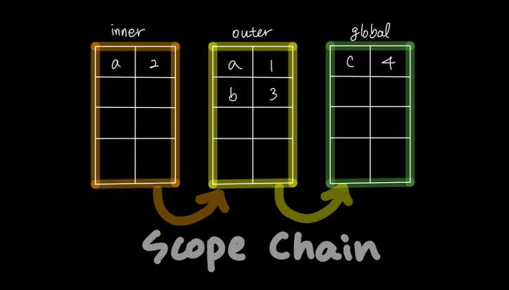

# 클로저

## 함수형 언어의 특징

```js
const x = 1;

function outerFunc() {
  const x = 10;

  function innerFunc() {
    console.log(x); // 10
  }

  innerFunc();
}

outerFunc();
```

위 예제에서 `innerFunc` 내부에서 자신을 포함하는 `outerFunc` 에 접근할 수 있습니다.
만약 `innerFunc` 함수를 `outerFunc` 외부에 선언하고 `innerFunc`를 `outerFunc` 내부에 호출하면 `outerFunc`의 변수에 접근할 수 없습니다.

```js
const x = 1;

function outerFunc() {
  const x = 10;
  innerFunc();
}

function innerFunc() {
  console.log(x); // 1
}

outerFunc();
```

이를 정리하자면 **함수 안에서만 그 함수에 접근할 수 있다는 것입니다**

자바스크립트가 **렉시컬 스코프**를 따르는 프로그래밍 언어이기 때문에 발생하는 현상입니다.

## 렉시컬 스코프

> 자바스크립트 엔진은 **함수를 어디서 호출했는지**가 아니라 함수를 **어디에 정의했는지**에 따라 상위 스코프를 결정합니다.
> 이를 **렉시컬 스코프** (정적 스코프) 라고 합니다.

```js
const x = 1;

function foo() {
  const x = 10;
  bar();
}

function bar() {
  console.log(x); // 10
}

foo(); // ?
bar(); // ?
```

foo와 bar 모두 전역에 정의된 전역 함수입니다.
함수를 어디서 호출하는지는 함수의 상위 스코프 결정에 영향을 주지 못합니다.
즉, 함수의 상위 스코프는 함수가 선언된 위치에서 고정되어 변하지 않습니다.

스코프가 곧 렉시컬 환경이기 때문에 `외부 렉시컬 환경에 대한 참조`를 통해 상위 렉시컬 환경과 연결되는 것을 **스코프 체인**이라고 부릅니다.



> 렉시컬 환경의 `외부 렉시컬 환경에 대한 참조`에 저장할 참조값, 즉 상위 스코프에 대한 참조는 함수 정의가 평가되는 시점에 함수가 정의된 환경(위치)에 의해 결정된다
>
> **이것이 바로 렉시컬 스코프입니다**

## 함수 객체의 내부 슬롯 \[\[Environment]]

함수가 정의되는 환경(위치)와 호출되는 위치는 다를 수 있습니다. 지금까지 살펴본 **렉시컬 스코프**가 가능하려면 상위 스코프를 기억하고 있어야 합니다. 이를 위해 함수는 자신의 **내부 슬롯 `[[Environment]]`** 에 자신이 정의된 환경인 **상위 스코프의 참조**를 저장합니다.

> 상위 스코프를 자기 내부슬롯에 저장

이때 상위 스코프는 **현재 실행중인** 실행 컨텍스트의 렉시컬 환경을 가리킵니다.

```js
const x = 1;

function foo() {
  const x = 10;
  bar();
}

function bar() {
  console.log(x);
}

foo();
bar();
```

위 예제를 그림으로 도식화하면 다음과 같습니다.


foo 함수와 bar 함수 모두 전역에서 평가되기 때문에 window의 메서드가 됩니다.
이때 생성된 두 함수 객체의 내부 슬롯 `[[Environment]]` 에 렉시컬 환경(전역)의 참조가 저장됩니다.

함수가 호출되면 내부 코드를 평가합니다. 평가 순서는 다음과 같습니다.

1. 함수 실행 컨텍스트 생성
2. 함수 렉시컬 환경 생성
   1. 함수 환경 레코드
   2. this 바인딩
   3. 외부 렉시컬 환경에 대한 참조

> 이때 함수 렉시컬 환경의 구성 요소인 `외부 렉시컬 환경에 대한 참조`에는 함수 객체의 내부 슬롯 `[[Environment]]`에 저장된 **렉시컬 환경의 참조**가 할당됩니다.
> 다시 말해, 함수 객체는 상위 스코프에 대한 참조를 가진다는 의미입니다.

지금까지의 내용이 의미하는 바는 다음과 같습니다.

🙅‍♀️🙅‍♂️**함수는 자신을 정의한 함수(상위 스코프)가 종료되더라도 그 함수를 잊지못합니다 ㅠㅠ** 🙅‍♂️🙅‍♀️


## 클로저와 렉시컬 환경

### 클로저란 무엇인가?

책에서 정리한 클로저의 정의를 살펴보자면

> 외부 함수보다 중첩 함수가 더 오래 유지되는 경우 중첩 함수는 이미 생명 주기가 종료한 외부 함수의 변수를 참조할 수 있다. **이러한 중첩 함수를 클로저라고 부른다.**

여기서 중요한 것은 **생명 주기가 종료한 함수**를 참조할 수 있다는 것입니다.
함수는 함수 내부에서밖에 접근하지 못합니다. 그럼 함수가 종료된 시점에 그 함수를 접근할 방법이 없는게 맞지만 클로저를 통하여 접근할 수 있습니다.

아래 예제 코드의 실행 컨텍스트를 통해 자세히 설명드리겠습니다.

```js
const x = 1;

// 1️⃣
function outer() {
  const x = 10;
  const inner = function () {
    console.log(x);
  }; // 2️⃣
  return inner;
}

const innerFunc = outer(); // 3️⃣
innerFunc(); // 4️⃣
```

#### 1️⃣ outer 정의


위 예제 코드의 1️⃣ 번에서 `outer`함수가 정의될 때 함수 객체가 만들어지고, 그 함수 객체 안의 내부슬롯 `[[Environment]]`에 상위 스코프인 `전역 렉시컬 환경`을 저장합니다.

#### 2️⃣ inner 정의


`outer`함수를 호출하여 렉시컬 환경이 생성되고 `외부 렉시컬 환경에 대한 참조`에 `outer` 함수 객체의 내부 슬롯 `[[Environment]]`에 저장되어 있던 상위 스코프, `전역 렉시컬 환경`을 할당합니다.

그리고 `inner`함수가 정의되면서 `inner`의 함수 객체가 생성되고 내부 슬롯 `[[Environment]]`에 상위 스코프인 `outer 렉시컬 환경`을 저장합니다.

#### 3️⃣ outer 호출


이후 `outer`함수는 `inner`함수를 반환하고 종료되어 실행 컨텍스트에서 사라집니다.
**하지만 `inner`함수가 `innerFunc`에 의해 참조되어 `inner`의 `외부 렉시컬 환경`인 `outer 렉시컬 환경`은 유지됩니다.**

#### 4️⃣ inner 호출


`inner`가 할당된 `innerFunc`이 호출되어 실행 컨텍스트에 추가되고 렉시컬 환경을 생성합니다. 이때 `inner`의 `[[Environment]]`에 저장되어 있던 `outer 렉시컬 환경`이 `외부 렉시컬 환경에 대한 참조`에 할당됩니다.

이렇게 중첩 함수 `inner`가 `outer`함수보다 오래 생존해서 이미 종료된 `outer`에 접근할 수 있었습니다.

### 그럼 모든 함수는 클로저인가?

일반적으로 모든 함수는 전역 아래에 정의됩니다. 그럼 전역의 중첩 함수가 되고 그 함수의 중첩 함수도 클로저이므로 모든 함수가 클로저라고 할 수 있을까요?

#### Case 1. 외부 함수의 식별자를 참조하지 않는 경우

```js
function foo() {
  const x = 1;
  const y = 2;

  function bar() {
    const z = 3;

    console.log(z);
  }
  return bar;
}

const bar = foo();
bar();
```

위 코드에서 `bar` 함수가 `foo` 외부 함수의 중첩 함수로써 정의됩니다. 하지만 `bar`함수는 `foo`의 어떤 식별자도 참조하고 있지 않습니다. 이러한 경우 `bar` 중첩 함수를 클로저라고 부리진 않습니다.

여기서 모던 웹브라우저는 `foo`가 참조되지 않기 때문에 `foo`를 가비지 컬랙팅의 대상으로 삼습니다. 즉, 참조되지 않는 외부 함수는 메모리에서 삭제됩니다.

#### Case 2. 중첩 함수의 생명 주기가 외부 함수보다 짧은 경우

```js
function foo() {
  const x = 1;

  function bar() {
    console.log(x);
  }
  bar();
}

foo();
```

위 예제는 `foo`안에 `bar` 중첩 함수가 실행되는 코드이고 `bar`가 정상적으로 외부 함수의 식별자를 참조하고 있지만 `foo`함수 안에서 실행이 종료됩니다. 즉, 외부 함수인 `foo`보다 생명 주기가 짧기 때문에 클로저로써 외부 함수를 기억하고 있을 수 없습니다.

## 정리

**클로저의 조건**을 요약하자면 다음과 같습니다.

1. 중첩 함수가 상위 스코프의 식별자를 참조하여야 한다.
2. 중첩 함수가 외부 함수보다 더 오래 유지되어야 한다.

```js
function foo() {
  const x = 1;
  const y = 2;

  function bar() {
    console.log(x);
  }
  return bar;
}

const closure = foo();
closure();
```

위 코드는 `bar` 중첩 함수가 외부 함수 `foo`의 식별자 `x`를 참조하고 있고, `closure` 변수에 `bar`가 할당되어 `foo` 외부 함수보다 오래 유지 되므로 클로저라고 할 수 있습니다.

클로저에 의해 참조되는 상위 스코프의 변수(x)를 **자유 변수**라고 부릅니다.
클로저는 이 자유 변수에 닫혀있다(closed)는 의미로, **"자유 변수에 묶여있는 함수"** 라고 할 수 있습니다.

클로저는 외부 함수를 기억하고 있어야 하기 때문에 메모리 점유를 걱정할 수도 있지만 모던 자바스크립트 엔진이 잘 최적화되어 있어서 참조하지 않는 식별자를 기억하지 않습니다.

따라서 자바스크립트의 강력한 기능인 이 클로저를 적극적으로 활용해야 된다고 합니다.

여러분도 한 번 클로저를 활용해보세요!! 👍


